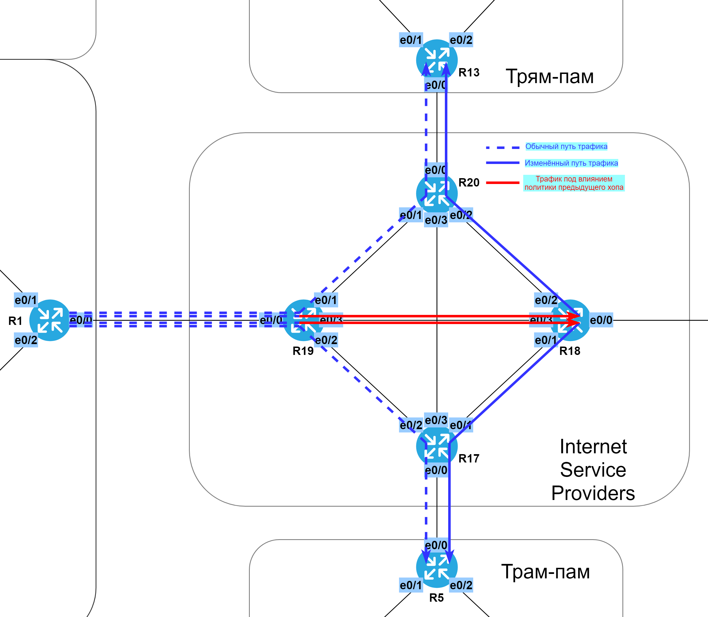

# Статическая маршрутизация. Policy-based routing & IP SLA.

###  Задание:

  1. Настроить статические маршруты так, чтобы маршрутизаторы R1, R5, R9 и R13 стали доступны между собой;
  2. На маршрутизаторе R19 необходимо настроить политику маршрутизации так, чтобы пакеты до R13 ходили через R18-R20;
  3. На маршрутизаторе R19 необходимо настроить политику маршрутизации так, чтобы пакет до R5 ходили через R18-R17;
  4. Разобраться в технологии IP SLA и настроить политику маршрутизации на основе мониторинга каналов. При отключении линка R19-R18, маршруты должны пойти между R19-R20 и R19-R17;
  5. Задокументировать все изменения.


###  1. Задокументируем требуемые изменения в статической маршрутизации.


  Таблица статических маршрутов.

| Eq  | Prot | Destination              | Gateway                | M | Comment (name)                       |
|-----|------|--------------------------|------------------------|---|--------------------------------------|
| R1  | IPv4 | 0.0.0.0/0                | 172.16.19.1            | 1 | to R19 (ISP)                         |
| R1  | IPv6 | ::/0                     | 20FF:CCFF:1000:19::1   | 1 | to R19 (ISP)                         |
| R5  | IPv4 | 0.0.0.0/0                | 172.16.17.1            | 1 | to R17 (ISP)                         |
| R5  | IPv6 | ::/0                     | 20FF:CCFF:1000:17::1   | 1 | to R17 (ISP)                         |
| R9  | IPv4 | 0.0.0.0/0                | 172.16.18.1            | 1 | to R18 (ISP)                         |
| R9  | IPv6 | ::/0                     | 20FF:CCFF:1000:18::1   | 1 | to R18 (ISP)                         |
| R13 | IPv4 | 0.0.0.0/0                | 172.16.20.1            | 1 | to R20 (ISP)                         |
| R13 | IPv6 | ::/0                     | 20FF:CCFF:1000:20::1   | 1 | to R20 (ISP)                         |
| R17 | IPv4 | 172.16.18.0/29           | 90.90.129.18/24        | 1 | to R18                               |
| R17 | IPv4 | 172.16.19.0/30           | 90.90.128.19/24        | 1 | to R19                               |
| R17 | IPv4 | 172.16.20.0/30           | 90.90.131.20/25        | 1 | to R20                               |
| R17 | IPv6 | 20FF:CCFF:1000:18::/64   | 20FF:CCFF:FFFF:2::18   | 1 | to R18                               |


### Просмотр настроенных статических маршрутов

```
show ip route static
show ipv6 route static
```



